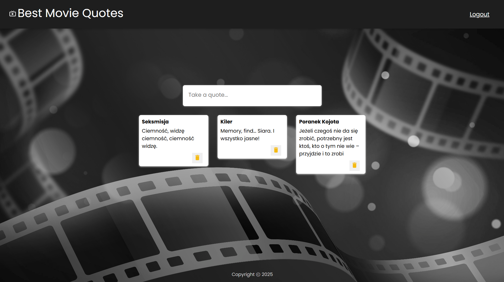
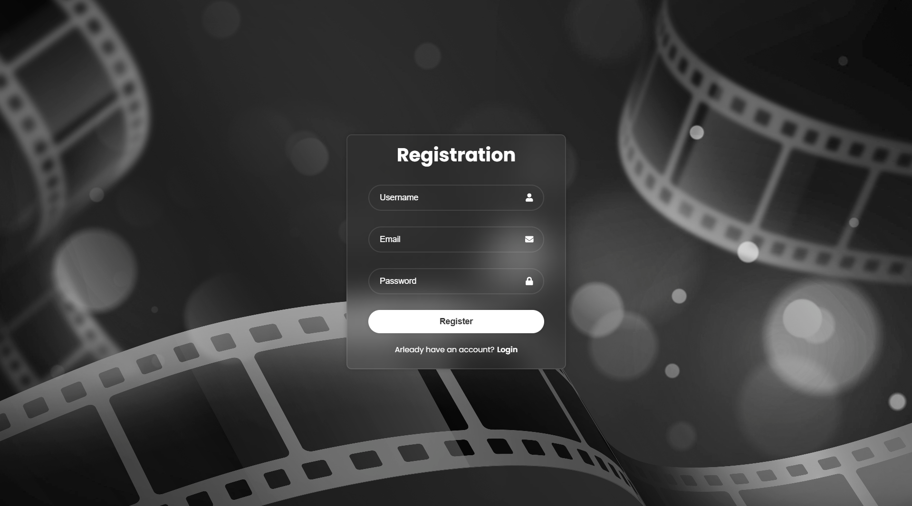
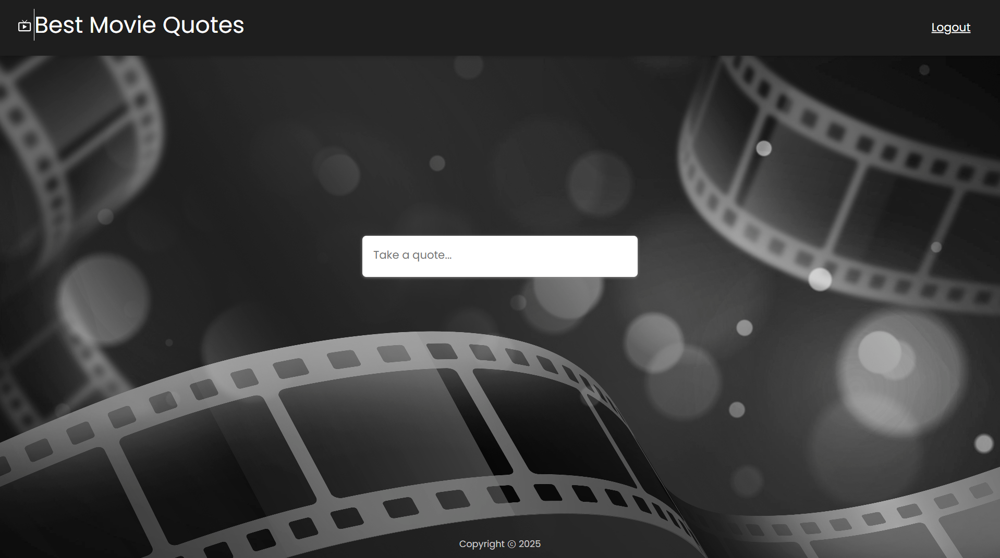

# Best Movie Quotes

An application for saving favorite quotes from movies and TV series

## Technologies Used
**React, JavaScript, JSON Server**

Best Movie Quotes is a web application built with the React framework. It uses a REST API to store and retrieve data from a file-based backend, allowing users to save their favorite quotes, reviews, and ratings.

  

  

The application includes both login and registration screens, enabling each user to maintain a personalized library of movie quotes or short movie reviews.
The clean UI and fast interactions make it easy to manage and browse saved content.

  

 

After logging in, the user is taken to the main screen, where they can add new quotes by providing the quote text, the movie or series title, and an optional rating or comment:

